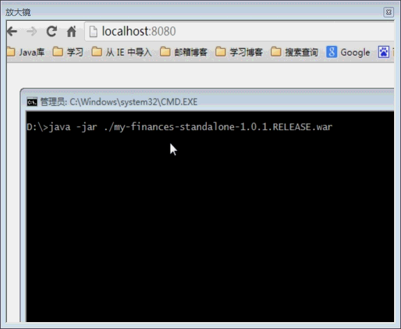
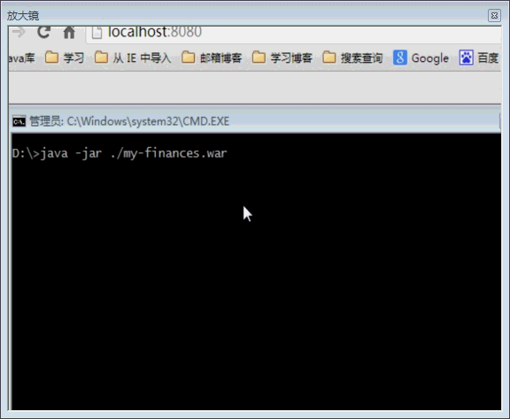

my-finances-standalone
======================

基于spring-boot的账单管理系统，可打成能独立运行war包，也打成war包发布到jsp容器运行。


 1.打包: `mvn clean package` 
 
 2.运行: `java -jar my-finances-standalone-1.0.1.RELEASE.war`

 3.如果是第一次运行:

 - 修改`my-finances-standalone.war/WEB-INF/classes/application.properties`文件
    - 把`spring.datasource.initialize=false` 改为 `spring.datasource.initialize=true`
    - 修改数据源 ```
    spring.datasource.driverClassName=com.mysql.jdbc.Driver
    spring.datasource.url=jdbc:mysql://localhost:3306/db_finance
    spring.datasource.username=root
    spring.datasource.password=123
  ```

4.如果想要发布成windows服务，或者不通过命令行执行程序,可以my-finances-standalone.war所在目录下新建一个my-finances-standalone.bat的批处理文件，并添加以下内容:
```
REM java -jar ./my-finances-standalone.war
start /B java -jar ./my-finances-standalone.war
```
 
**效果截图:**


